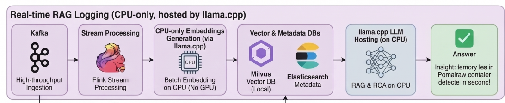

# Pomai Ecosystem: Enterprise-Grade Microservices Architecture Case Study

*Figure 1: High-level macro-services architecture featuring Kong Gateway, Apache Kafka, and PostgreSQL.*

## Executive Summary
Pomai Ecosystem is a comprehensive case study demonstrating the evolution from a multi-module Firebase monolith to a robust, event-driven microservices architecture. 

This repository serves as a **Technical Blueprint**. It does not contain the entire proprietary product source code, but rather showcases the core architectural patterns, infrastructure-as-code (IaC) configurations, and system design decisions that power the ecosystem.

---

##Tech Stack Highlights

| Domain | Core Technologies |
| :--- | :--- |
| **Backend / Logic** | Node.js, Strategy & Factory Design Patterns |
| **Data Layer** | PostgreSQL, Prisma ORM, Elasticsearch, Qdrant (Vector DB) |
| **Event Streaming** | Apache Kafka (Transactional Outbox Pattern) |
| **API Gateway** | Kong Gateway, Nginx (Layer 7 Load Balancer) |
| **DevOps & CI/CD** | Docker, Portainer, Jenkins, Gitea (Self-hosted) |
| **Observability** | Prometheus, Grafana, cAdvisor, Apache Flink |
| **AI Integration** | Llama.cpp (CPU-only embeddings & inference) |

---

## The Architecture Series (Full Case Studies)
To understand the *"Why"* behind the technical decisions, the trade-offs, and the engineering journey, please read my detailed engineering blog series:

1. **[From Monolith to Microservices: An Architectural Evolution](https://pomaidb-web.vercel.app/blog/pomaieco-from-multimodules-monolith-to-microservice-and-why)** - *Why I migrated away from Firebase and restructured domain boundaries.*
2. **[The Dual-Write Dilemma: Ensuring Data Integrity](https://pomaidb-web.vercel.app/blog/distributed-data-integrity-outbox-pattern-kafka)** - *How I solved distributed transactions using the Outbox Pattern and Kafka.*
3. **[From Port-Hell to High Availability (Kong + Nginx)](https://pomaidb-web.vercel.app/blog/api-gateway-kong-nginx-high-availability)** - *Designing an enterprise-grade, SPOF-free API Gateway cluster.*
4. **[Taking Back Control: A Self-Hosted CI/CD Pipeline](https://pomaidb-web.vercel.app/blog/self-hosted-cicd-gitea-jenkins-docker)** - *Building a zero-downtime deployment engine with Jenkins and Gitea.*
5. **[AI-Driven Observability: A 1M+ Log Analysis Pipeline](https://pomaidb-web.vercel.app/blog/ai-driven-observability-rag-logging-pipeline)** - *Processing logs with Flink and performing Root Cause Analysis using CPU-only RAG (Llama.cpp).*

---

## Repository Showcase (Where to find the code)
Tech Leads and Reviewers: You can explore the specific implementations of the patterns discussed in the blogs through the folders below:

*   /architecture-patterns/strategies/` - Contains the `BaseTaskStrategy` and `WorkspaceFactory` demonstrating clean domain isolation without deep `if/else` nesting.
*   📁 `/infrastructure/gateway/` - Nginx configuration acting as a round-robin load balancer in front of the Kong cluster.
*   📁 `/infrastructure/docker-compose/` - The comprehensive setup for Kafka, PostgreSQL, Kong, and the AI logging pipeline.
*   📁 `/database/prisma/` - The `schema.prisma` file showcasing relational data modeling and the `Outbox` table schema for Kafka events.
*   📁 `/ci-cd/` - Sample `Jenkinsfile` demonstrating the automated build, test, and deploy pipeline.

---

## 🧠 Special Highlight: CPU-Only RAG Logging Pipeline

*Figure 2: Transforming raw Kafka streams into semantic insights using CPU-bound Llama.cpp.*

Rather than relying on expensive cloud observability tools, this ecosystem features a custom-built AI logging pipeline capable of autonomous Root Cause Analysis (RCA) on standard hardware. *(See Blog #5 for deep dive).*